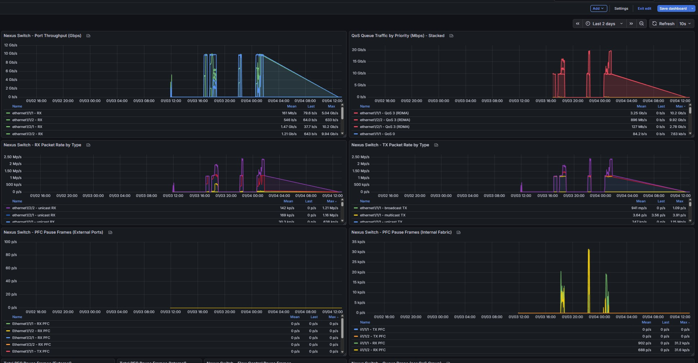

# Monitoring Lossless Ethernet with Grafana and Prometheus

> Complete observability stack for RoCE/RDMA networks with Priority Flow Control (PFC) and Explicit Congestion Notification (ECN)

[]()
[]()
[]()
[]()

## Overview

This repository provides a complete monitoring solution for lossless ethernet networks using Prometheus and Grafana. It makes the invisible visible - exposing metrics that prove your congestion control is working:

- **40M+ ECN-marked packets** - Proof that switch is marking packets during congestion
- **34M+ CNP packets** - Receiver-sender congestion notifications working
- **133M+ ESXi pause frames** - Hypervisor-level flow control active
- **126M+ Switch internal PFC** - Internal fabric congestion management

## The Problem

RDMA networks operate with kernel bypass - traditional monitoring tools are blind to what's happening:

- `tcpdump` shows ~5K packets while RDMA handles 48M+ operations
- Network stack counters don't reflect RDMA traffic
- ECN/CNP statistics hidden in hardware
- PFC pause frames not visible in standard metrics
- ESXi hypervisor metrics require special collection

**How do you prove your lossless network is actually lossless?**

## The Solution

Custom Prometheus exporters that expose metrics directly from hardware:

1. **Server RDMA Statistics** - ECN/CNP metrics from NICs
2. **ESXi Pause Frames** - Hypervisor-level flow control
3. **Switch PFC Metrics** - Both physical and internal fabric
4. **Grafana Dashboards** - Real-time visualization

## Architecture

```
┌─────────────────────────────────────────────────────────────┐
│                    Grafana Dashboards                        │
│         ECN/CNP Stats | ESXi Pause | Switch PFC              │
└──────────────────────┬──────────────────────────────────────┘
                       │
┌──────────────────────▼──────────────────────────────────────┐
│              Prometheus (Port 9090)                          │
│  Scraping every 15s from all exporters                       │
└───┬────────────────┬────────────────┬───────────────────────┘
    │                │                │
┌───▼──────┐    ┌────▼────┐    ┌─────▼──────────┐
│  RDMA    │    │  ESXi   │    │  Nexus Switch  │
│ Servers  │    │ Exporter│    │   Exporter     │
│ (x8)     │    │ (9104)  │    │   (9102)       │
│          │    │         │    │                │
│ rdma     │    │ vsish   │    │ show interface │
│ statistic│    │ SSH     │    │ priority-flow  │
│ show     │    │ collect │    │ SSH collect    │
└──────────┘    └─────────┘    └────────────────┘
  Port 9103
```

## Quick Start

### 1. Install Prometheus and Grafana

```bash
# Install Prometheus
bash install_prometheus_server1.sh

# Install Grafana
bash install_grafana_server1.sh

# Verify installations
curl http://localhost:9090
curl http://localhost:3000
```

### 2. Deploy Exporters

**RDMA Stats Exporter (on each RDMA server):**
```bash
# Copy to server
scp rdma_stats_exporter.py user@server:/opt/

# Run exporter
python3 /opt/rdma_stats_exporter.py
# Listens on port 9103
```

**ESXi Stats Exporter (on monitoring server):**
```bash
# Requires sshpass
sudo apt-get install -y sshpass

# Run exporter
python3 esxi_stats_exporter.py
# Listens on port 9104
# Collects from ESXi hosts via SSH
```

**Nexus Switch Exporter (on monitoring server):**
```bash
# Run exporter
python3 nexus_prometheus_exporter.py
# Listens on port 9102
# Collects from switch via SSH
```

### 3. Configure Prometheus

Add to `/etc/prometheus/prometheus.yml`:

```yaml
scrape_configs:
  # RDMA server statistics
  - job_name: 'rdma-servers'
    scrape_interval: 15s
    static_configs:
      - targets:
          - '192.168.11.152:9103'
          - '192.168.11.153:9103'
          - '192.168.11.154:9103'
          - '192.168.11.155:9103'
          - '192.168.11.107:9103'
          - '192.168.12.51:9103'
          - '192.168.20.150:9103'
          - '192.168.30.94:9103'

  # ESXi pause frame statistics
  - job_name: 'esxi-hosts'
    scrape_interval: 15s
    static_configs:
      - targets: ['192.168.11.152:9104']

  # Nexus switch PFC/QoS statistics
  - job_name: 'nexus-switch'
    scrape_interval: 30s
    static_configs:
      - targets: ['192.168.11.152:9102']
```

Restart Prometheus:
```bash
sudo systemctl restart prometheus
```

### 4. Import Grafana Dashboards

1. Open Grafana: `http://your-server:3000`
2. Go to Dashboards → Import
3. Upload `grafana_rdma_dashboard_fixed.json`
4. Upload `grafana_nexus_switch_dashboard_final.json`
5. Select Prometheus datasource
6. Click Import

### 5. Verify Metrics

```bash
# Check RDMA exporter
curl http://192.168.11.152:9103/metrics | grep rdma_ecn_marked_packets
# Expected: rdma_ecn_marked_packets{...} 40000000+

# Check ESXi exporter
curl http://192.168.11.152:9104/metrics | grep esxi_pause_rx_phy
# Expected: esxi_pause_rx_phy{host="esxi1",vmnic="vmnic5"} 133000000+

# Check Switch exporter
curl http://192.168.11.152:9102/metrics | grep nexus_pfc_rx_frames
# Expected: nexus_pfc_rx_frames{interface="ii1/1/1"} 126000000+
```

## Dashboards

### RDMA Server Monitoring


**Key Panels:**
- ECN-Marked Packets Rate (packets/sec)
- CNP Packets Sent/Handled
- RDMA Write Operations
- ESXi Pause Frames per vmnic
- Out-of-Sequence Packets

### Nexus Switch Monitoring



**Key Panels:**
- PFC Frames - Physical Ports
- PFC Frames - Internal Fabric (ii ports)
- QoS Group 3 Traffic (RDMA)
- MMU Buffer Drops
- Per-Interface Statistics

## Exporters

### 1. RDMA Stats Exporter

**File:** `rdma_stats_exporter.py`
**Port:** 9103
**Source:** `rdma statistic show link <device>`

**Metrics Exported:**
```python
rdma_ecn_marked_packets      # ECN marking by switch
rdma_cnp_sent                # CNP notifications sent by receivers
rdma_cnp_handled             # Rate reductions by senders
rdma_cnp_ignored             # CNP packets ignored
rdma_rx_write_requests       # RDMA write operations
rdma_rx_read_requests        # RDMA read operations
rdma_out_of_sequence         # Packet reordering events
rdma_packet_seq_err          # Sequence errors
rdma_ack_timeout_err         # ACK timeouts
```

**Example Metric:**
```
rdma_ecn_marked_packets{host="ubunturdma5",device="rocep11s0",port="1"} 40394737
```

**Configuration:**
```python
# Automatically detects RDMA devices
# Runs on each RDMA server
# Flask server on port 9103
```

### 2. ESXi Stats Exporter

**File:** `esxi_stats_exporter.py`
**Port:** 9104
**Source:** `vsish -e cat /net/pNics/*/stats` via SSH

**Metrics Exported:**
```python
esxi_pause_rx_phy            # Physical RX pause frames
esxi_pause_tx_phy            # Physical TX pause frames
esxi_pause_rx_global         # Global RX pause
esxi_pause_tx_global         # Global TX pause
esxi_pause_rx_duration       # RX pause duration
esxi_pause_rx_transitions    # Pause state changes
esxi_pause_storm_warnings    # Pause storm warnings
esxi_pause_storm_errors      # Pause storm errors
```

**Example Metric:**
```
esxi_pause_rx_phy{host="esxi1",vmnic="vmnic5",esxi_ip="192.168.50.32"} 133704835
```

**Configuration:**
```python
ESXI_HOSTS = {
    "esxi1": {
        "ip": "192.168.50.32",
        "vmnics": ["vmnic5", "vmnic6"],
        "user": "root",
        "password": "your_password"
    },
    "esxi2": {
        "ip": "192.168.50.152",
        "vmnics": ["vmnic3", "vmnic4"],
        "user": "root",
        "password": "your_password"
    }
}
```

### 3. Nexus Switch Exporter

**File:** `nexus_prometheus_exporter.py`
**Port:** 9102
**Source:** `show interface priority-flow-control` via SSH

**Metrics Exported:**
```python
nexus_pfc_rx_frames          # PFC frames received
nexus_pfc_tx_frames          # PFC frames transmitted
nexus_qos_group_packets      # QoS group traffic
nexus_qos_group_bytes        # QoS group bytes
nexus_mmu_drops              # MMU buffer drops
```

**Example Metric:**
```
nexus_pfc_rx_frames{interface="ii1/1/1",priority="3"} 126464312
```

## PromQL Queries

### ECN/CNP Monitoring

```promql
# ECN-marked packets rate (showing congestion detection)
rate(rdma_ecn_marked_packets[1m])

# CNP packets sent rate (congestion notifications)
rate(rdma_cnp_sent[1m])

# CNP handling rate (rate reductions performed)
rate(rdma_cnp_handled[1m])

# Total RDMA operations across cluster
sum(rate(rdma_rx_write_requests[5m]))
```

### ESXi Pause Frame Monitoring

```promql
# Pause frames rate per vmnic
rate(esxi_pause_rx_phy[1m])

# Pause state transitions (showing active flow control)
rate(esxi_pause_rx_transitions[1m])

# Total pause frames across all vmnics
sum(esxi_pause_rx_phy)
```

### Switch PFC Monitoring

```promql
# PFC frames on internal fabric only
rate(nexus_pfc_rx_frames{interface=~"ii.*"}[1m])

# PFC frames on physical ports (should be low/zero)
rate(nexus_pfc_rx_frames{interface=~"Ethernet.*"}[1m])

# QoS Group 3 traffic (RDMA traffic class)
rate(nexus_qos_group_bytes{qos_group="3"}[5m])

# MMU drops (should be zero with PFC working)
nexus_mmu_drops
```

## What the Metrics Prove

### Two-Layer Congestion Control

Our monitoring reveals both layers working simultaneously:

**Layer 2 (PFC):** Switch ↔ ESXi
- 133M+ pause frames on ESXi vmnic5
- 126M+ PFC frames on switch internal fabric (ii ports)
- 0 PFC frames on physical ports (clean egress)

**Layer 3 (ECN/CNP):** Server ↔ Server
- 40M+ ECN-marked packets (switch marking during congestion)
- 34M+ CNP packets sent (receivers notifying senders)
- 9M+ CNP packets handled (senders reducing rate)

### Lossless Operation Confirmed

- **0 MMU drops** - Buffers never overflow
- **0 packet loss** - PFC prevents drops before they occur
- **Active congestion control** - ECN and CNP working proactively
- **100% link utilization** - Maximum throughput with zero loss

### Internal vs External Congestion

Switch metrics show congestion is managed internally:
- **Internal fabric (ii ports):** 48-126M PFC frames
- **Physical ports:** 0 PFC frames

This means the switch handles cross-ASIC congestion internally before it reaches the servers - exactly what we want!

## Files in This Repository

**Exporters:**
- `rdma_stats_exporter.py` - Server RDMA metrics (port 9103)
- `esxi_stats_exporter.py` - ESXi pause frames (port 9104)
- `nexus_prometheus_exporter.py` - Switch PFC/QoS (port 9102)
- `rdma_exporter.py` - Alternative RDMA exporter (port 9101)

**Dashboards:**
- `grafana_rdma_dashboard_fixed.json` - RDMA server monitoring
- `grafana_nexus_switch_dashboard_final.json` - Switch monitoring

**Installation:**
- `install_prometheus_server1.sh` - Prometheus installation script
- `install_grafana_server1.sh` - Grafana installation script
- `PROMETHEUS_GRAFANA_INSTALLATION_GUIDE.md` - Complete setup guide

**Documentation:**
- `LINKEDIN_POST_MONITORING.md` - Professional summary of monitoring work
- `README.md` - This file

**Screenshots:**
- `grafanardma server.jpg` - RDMA dashboard screenshot
- `grafananexus.jpg` - Switch dashboard screenshot

## Requirements

**Software:**
- Prometheus 2.x or higher
- Grafana 9.x or higher
- Python 3.8+
- Flask (for exporters)
- paramiko (for SSH connections)
- sshpass (for ESXi exporter)

**Network Equipment:**
- RDMA-capable NICs (Mellanox/NVIDIA ConnectX-4 or newer)
- Switch with PFC support (Cisco Nexus, Arista, etc.)
- ESXi hosts (for hypervisor monitoring)

**Access:**
- SSH access to RDMA servers
- SSH access to ESXi hosts (root)
- SSH access to network switches

## Installation Guide

See [PROMETHEUS_GRAFANA_INSTALLATION_GUIDE.md](PROMETHEUS_GRAFANA_INSTALLATION_GUIDE.md) for detailed installation instructions.

Quick summary:
1. Install Prometheus and Grafana
2. Deploy exporters to servers
3. Configure Prometheus scrape jobs
4. Import Grafana dashboards
5. Verify metrics collection

## API Examples

### Query Prometheus API

```bash
# Get current ECN-marked packets
curl 'http://192.168.11.152:9090/api/v1/query?query=rdma_ecn_marked_packets'

# Get ECN packets rate over last 5 minutes
curl 'http://192.168.11.152:9090/api/v1/query?query=rate(rdma_ecn_marked_packets[5m])'

# Get all targets status
curl http://192.168.11.152:9090/api/v1/targets | jq
```

### Query Exporter Directly

```bash
# RDMA exporter
curl http://192.168.11.152:9103/metrics

# ESXi exporter
curl http://192.168.11.152:9104/metrics

# Switch exporter
curl http://192.168.11.152:9102/metrics
```

## Troubleshooting

### Exporter Not Starting

```bash
# Check if port is already in use
sudo netstat -tlnp | grep 9103

# Check Python dependencies
pip3 install flask paramiko

# Run exporter in foreground to see errors
python3 rdma_stats_exporter.py
```

### No Metrics in Grafana

```bash
# Check Prometheus targets
curl http://localhost:9090/api/v1/targets

# Verify exporter is accessible
curl http://192.168.11.152:9103/metrics | head

# Check Prometheus logs
sudo journalctl -u prometheus -f
```

### ESXi Exporter SSH Errors

```bash
# Test SSH connection manually
sshpass -p 'password' ssh root@192.168.50.32 'vsish -e cat /net/pNics/vmnic5/stats | grep pause'

# Check sshpass is installed
which sshpass

# Verify ESXi credentials in exporter config
```

## Use Cases

This monitoring stack is ideal for:

- **RDMA/RoCE Networks** - Validate ECN and PFC are working
- **AI/ML Training Clusters** - Ensure lossless all-reduce operations
- **Storage Networks** - Monitor NVMe-oF, iSER performance
- **HPC Environments** - Verify low-latency, high-throughput
- **Database Clusters** - Track distributed query performance
- **Any Lossless Ethernet** - Prove congestion control is active

## Performance

**Monitoring Overhead:**
- Prometheus: ~100MB RAM, <1% CPU
- Each exporter: ~50MB RAM, <1% CPU
- Grafana: ~200MB RAM, <2% CPU
- Network: <1Mbps for metrics collection

**Collection Frequency:**
- RDMA/ESXi: Every 15 seconds
- Switch: Every 30 seconds
- Historical retention: 15 days (configurable)

## Contributing

This is a reference implementation for monitoring lossless ethernet networks. Feel free to:
- Open issues for questions
- Submit pull requests with improvements
- Share your own monitoring configurations
- Report bugs or suggest features

## License

This monitoring stack is provided as-is for educational and reference purposes.

## Related Resources

- **Main RDMA Repository:** [rdma-ai-cluster](https://github.com/Enizaksoy/rdma-ai-cluster)
- **Prometheus Documentation:** https://prometheus.io/docs/
- **Grafana Dashboards:** https://grafana.com/docs/
- **Mellanox RDMA:** https://docs.nvidia.com/networking/

## Acknowledgments

- Prometheus and Grafana communities
- NVIDIA/Mellanox for RDMA tools and documentation
- Cisco for Nexus switch documentation
- VMware for ESXi monitoring interfaces

---

**Status:** ✅ Production Ready | **Last Updated:** January 2026

**If you find this useful, please star the repository!**

## Contact

- GitHub: [@Enizaksoy](https://github.com/Enizaksoy)
- Repository: [lossless-ethernet-monitoring](https://github.com/Enizaksoy/lossless-ethernet-monitoring)

---

**Monitoring makes lossless networks provably lossless!**
